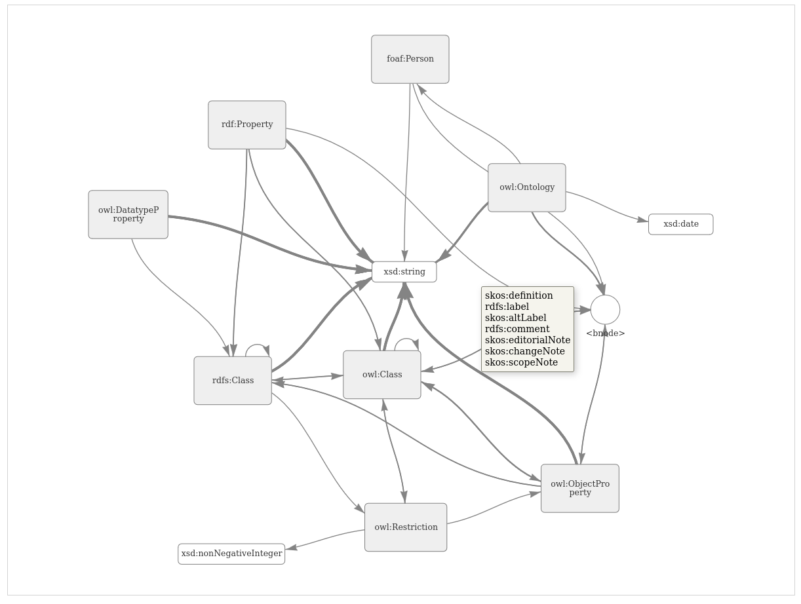
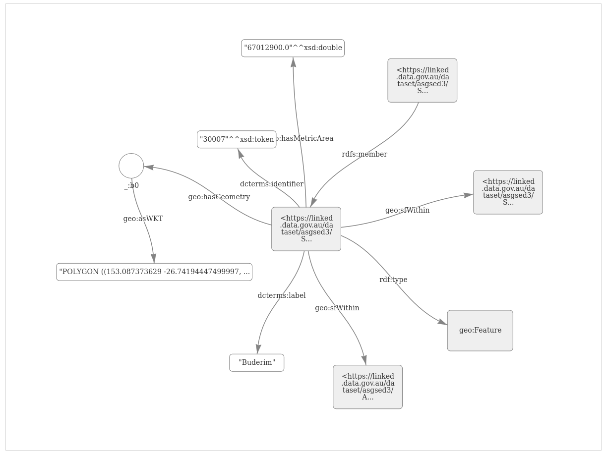
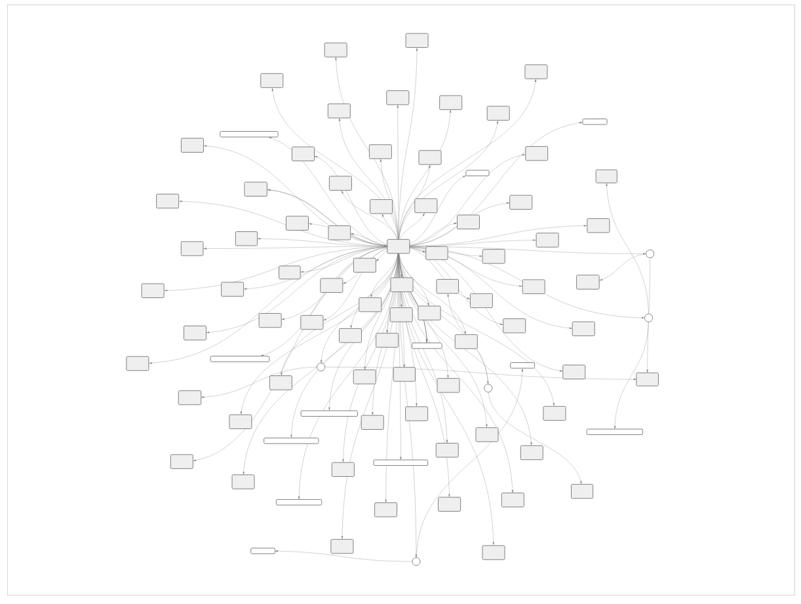
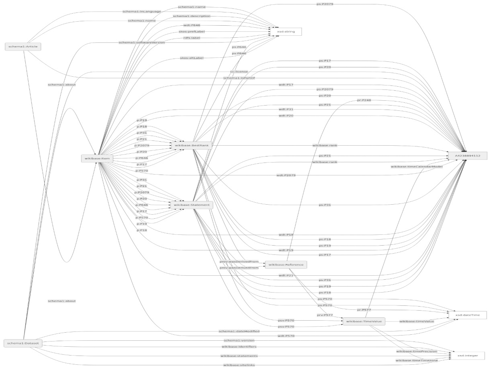

# RDFdig

A command line tool for creating diagrams of RDF data.

RDFdig is designed to be extensible and composable with sane defaults out of the box. If
you just want to quickly spin up a nice looking diagram of some RDF data,
then RDFdig has you covered.

If you need to create your own custom diagram then you can do that too. RDFdig will help you
load and process the RDF in whatever format you need.

The default _class level diagram_ created by RDFdig gives a clean view of your data.
Much more so then is typical of RDF visualisation tools. It lets you see the schema of the
data without getting bogged down with too much detail.

RDFdig relies on the awesome [RDFLib](https://github.com/rdflib/rdflib) library for the heavy lifting RDF tasks.

It also uses [vis.js](https://visjs.org) and [mermaid](https://mermaid.js.org) for rendering the diagrams, but you can easily
extend RDFdig with custom renderes if you need something else.

## Screenshots

|                                                                        |                                                                      |
| ---------------------------------------------------------------------- | -------------------------------------------------------------------- |
|                         |  |
|  |                         |

## Features

- No fuss, good looking, diagrams of RDF data,
- Interactive and static diagram rendering,
- Load data from files, folders, and SPARQL endpoints in any format supported by RDFLib,
- Render using vis.js for awesome interactive diagrams,
- Render with mermaid to create portable, documentation ready diagrams,
- Generate `JSON` nodes and edges to create a diagram with the tool of your choice.

> [!IMPORTANT]
> get a birds eye view of your data model with a class level diagram.
> these diagrams give you a clean view of the rdf:type's of resources
> in your data and how they relate to one another.

## Installation

RDFdig is available as a github release asset.

To install RDFdig using pip

```bash
pip install https://github.com/Kurrawong/rdfdig/archive/refs/tags/v{version-number}.zip
```

A PyPi package is planned and coming soon.

## Usage

RDFdig can be called as a command line utlity or you can import the `Diagram` class and
incorporate it into your own code.

### Command line usage

Generate nodes and edges from the RDF in `myfile.ttl` and render the output in the browser

```bash
rdfdig myfile.ttl --render
```

> [!NOTE]
> The rendered diagram is saved to a temp file and opened in the default web browser for
> viewing.

Generate nodes and edges from the RDF files in the `data` directory and pipe the results
into [jq](https://jqlang.github.io/jq/) for display

```bash
rdfdig data | jq
```

Generate a diagram from the data at the remote SPARQL endpoint

```bash
rdfdig "https://example.org/sparql" --render
```

Same again but only query the specified named graph

```bash
rdfdig "https://example.org/sparql" --graph "https://mygraph" --render
```

> [!NOTE]
> RDFdig can even handle basic username, password authentication if required.
> see `rdfdig --help` to find out how.

Generate an instance level diagram for the given resource and render it as a mermaid
diagram

```bash
rdfdig "https://example.org/sparql" --iri "ex:resource1" --render --format mermaid
```

> [!NOTE]
> notice that you can even prefix the iri, and as long as the prefix is defined in the
> source data, it will be automatically expanded.

To see all the available options

```bash
rdfdig --help
```

### Usage as a module

RDFdig exposes the `Diagram` class which contains all the methods and properties needed
to load, parse, serialize and render a diagram from RDF data.

A simple example

```python
from rdfdig import Diagram
from pathlib import Path

# initialise the diagram object
diagram = Diagram()

# load data from a file
diagram.parse(source="path/to/myfile.ttl")

# print the computed nodes and edges as a stringified JSON object
print(diagram.serialize())

# open the web browser to view a rendered diagram of the data
# in the specified format
diagram.render(format="mermaid")
```

## Attributions

This tool has been developed by [KurrawongAI](https://kurrawong.ai) and is free to use
and redistribute under the The 3-Clause BSD License.

## See Also

[ontogram](https://github.com/edmondchuc/ontogram) - similar RDF visualisation tool.
